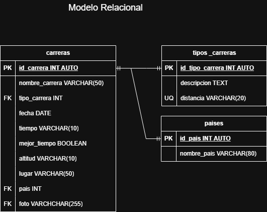

# Carreras

## Listado de Entidades

### carreras (**ED**)

- id_carrera (**PK**)
- nombre_carrera
- tipo_carrera (**FK**)
- fecha
- tiempo
- mejor_tiempo
- altitud
- lugar
- pais (**FK**)
- foto

### tipos carreras (**EC**)

- id_tipo_carrera (**PK**)
- descripcion
- distancia

### Paises (**EC**)

- id_pais (**PK**)
- nombre_pais

### Relaciones

Una **Carrera** _Pertenece_ a un **Tipo de Carrera** (_1_ a _1_)

Una **Carrera** se _Corre_ en un **Pais** (_1_ a _1_)

## Diagrama

## Reglas de Negocio

### carreras

1. Crear el registro de una carrera.
1. Leer el registro de una(s) carrera(s) dada una condicion en particular.
1. Leer todos los registros de la entidad carrera.
1. Actualizar los datos de una carrera dada una condicion en particular.
1. Eliminar los datos de una carrera dada una condicion en particular.

### tipos_carreras

1. Crear el registro de un tipo de carrera.
1. Leer el registro de uno(s) tipo(s) de carrera(s) dada una condicion en particular.
1. Leer todos los registros de la entidad tipos carreras. 
1. Actualizar los datos de un tipo carrera dada una condicion en particular.
1. Eliminar los datos de un tipo de carrera dada una condicion en particular.

### paises

1. Crear el registro de un pais.
1. Leer el registro de un(os) pais(es) dada una condicion en particular.
1. Leer todos los registros de la entidad paises. 
1. Actualizar los datos de un pais dada una condicion en particular.
1. Eliminar los datos de un pais dada una condicion en particular.